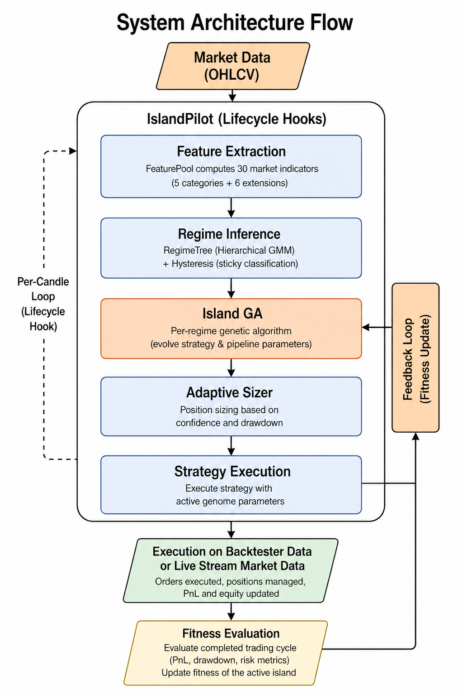

## 3. System Architecture

IslandPilot operates as a five-layer pipeline that intercepts strategy execution at defined lifecycle hooks (`on_before`, `gate_entry`, `suggest_exit`, `on_cycle_end`) without modifying strategy source code. The five layers, described in subsections §3.1 to §3.5, are: (1) feature extraction from candle data; (2) hierarchical regime discovery; (3) hysteresis-based regime inference; (4) island-model genetic evolution; and (5) adaptive position sizing. Section §3.6 documents parameter application and supporting design constraints that span all five layers.

### 3.1 Feature Extraction

The FeaturePool computes 30 market indicators from OHLCV candle data across five categories: volatility, trend, choppiness, momentum, and market structure. The pool is structured as 24 empirical-technical indicators (standard conventions from the technical analysis literature) plus 6 theoretically-motivated extensions that close specific gaps in the base feature space. Features are computed on a fixed 300-candle sliding window, maintaining O(1) computational cost per candle regardless of backtest length. The 5-minute base timeframe is chosen as a balance between signal granularity (intraday FX volatility patterns are visible at this resolution) and computational cost (the 36-month training window contains approximately 221,000 5-minute bars, tractable for the per-evaluation real-engine fitness budget; see Section 4).

The indicator periods were selected by adopting standard conventions from the technical analysis literature and then validating that they produce discriminative features for the specific task of Martingale cycle outcome prediction. Period 14 is the standard lookback for RSI, ATR, and ADX as originally defined by Wilder (1978), and remains the de facto default across practitioner and academic usage (Colby, 2003). We retained this convention rather than optimising the lookback because (a) it enables direct comparison with published results that use identical indicator definitions, and (b) the mutual information feature selection described below acts as a second filter that eliminates features regardless of their conventional standing if they lack discriminative power for this task. Period 50 is widely adopted as a medium-term volatility benchmark in FX markets (Katz & McCormick, 2000); its inclusion alongside period 14 captures the ATR ratio (ATR_14 / ATR_50), which measures short-term volatility relative to the medium-term baseline, a derived feature specific to our regime detection objective rather than a generic convention. The 8/21 EMA pair follows the Fibonacci-derived convention common in short-term momentum systems (Kaufman, 2013), chosen because the Martingale strategy's entry signals use EMA crossovers at these periods, meaning the slope features directly reflect the signal generation mechanism. The Hurst exponent window of 100 follows the recommendation of Di Matteo et al. (2005), who demonstrated that windows of 50-200 observations provide stable R/S estimates for financial time series. The Choppiness Index at period 14 and Efficiency Ratio at periods 50/100 follow the implementations described by Kaufman (2013) for adaptive trading system design. The choice to adopt established periods rather than optimising them is deliberate: period optimisation would introduce an additional degree of freedom that risks overfitting to the training data, while standard periods are pre-validated across decades of market data and multiple instruments.

The full feature set is:

**Volatility (5):** Normalised Average True Range at periods 14 and 50 (NATR_14, NATR_50), ATR ratio (ATR_14 / ATR_50), Bollinger bandwidth ((upper - lower) / middle at period 20; Bollinger, 2002), and raw ATR_14.

**Trend (6):** Average Directional Index at periods 14 and 28 (ADX_14, ADX_28; Wilder, 1978), EMA slope at periods 8 and 21 defined as the percentage change (EMA[t] - EMA[t-1]) / EMA[t-1], Aroon oscillator (Aroon_up - Aroon_down; Chande, 1997), and directional movement differential (DM+ - DM-; Wilder, 1978).

**Choppiness (4):** Choppiness Index at period 14 (CHOP_14; Kaufman, 2013), Kaufman Efficiency Ratio at periods 50 and 100 (ER_50, ER_100; Kaufman, 2013), and rolling Hurst exponent at window 100 computed via R/S analysis (Hurst, 1951; Di Matteo et al., 2005).

**Momentum (5):** Relative Strength Index at periods 14 and 28 (RSI_14, RSI_28; Wilder, 1978), Commodity Channel Index at period 20 (CCI_20; Lambert, 1983), Rate of Change at period 10 (ROC_10), and Stochastic %K (Lane, 1984).

**Structure (4):** Session hour (UTC), day of week, normalised high-low range ((high - low) / close), and close position within range ((close - low) / (high - low)).

**Extensions, Dimension 1: HAR-RV multi-scale volatility (2 features).** NATR_14 computed on candles aggregated by factors of 12× and 48× relative to the base 5m timeframe (equivalent to approximately 1h and 4h horizons), broadcast back to the base timeframe. This implements the Heterogeneous Autoregressive model of Realized Volatility (Corsi, 2009), which demonstrates that three time-horizons are sufficient and parsimonious for realized-volatility modelling. Müller et al. (1997) showed that information flows asymmetrically across scales (long → short), making multi-scale volatility a regime signal rather than a redundancy with NATR_14. Feature names: NATR_14_TF12, NATR_14_TF48.

**Extensions, Dimension 2: Distributional shape (3 features).** (i) Rolling standard deviation of NATR_14 over 50 bars (vol-of-vol; Engle, 1982; Barndorff-Nielsen & Shephard, 2002), distinguishing stable high-volatility regimes from regime-transition periods where volatility itself is unstable. (ii) Rolling standardised skewness of log returns over 100 bars (Neuberger, 2012; Harvey & Siddique, 2000); negative skew indicates downside asymmetry, the dominant failure mode for Martingale long positions. (iii) Rolling excess kurtosis of log returns over 100 bars; elevated kurtosis signals fat-tail conditions. The 100-bar window follows Neuberger (2012) Table 1 for stable realized-moment estimation at high frequency. Feature names: VOL_OF_VOL_50, RETURN_SKEW_100, RETURN_KURT_100.

**Extensions, Dimension 3: Short-lag serial dependence (1 feature).** Rolling lag-1 autocorrelation of log returns over 100 bars (Lo & MacKinlay, 1988 variance-ratio framework; Box & Jenkins, 1976 AR identification). Positive values indicate momentum / trending conditions (adverse for Martingale); negative values indicate mean-reversion (favourable). Box & Jenkins (1976) show that lag-1 captures ≥80% of AR(1) information, making a single lag sufficient. Feature name: RETURN_AC_LAG1_100.

Feature selection is performed via mutual information (Kraskov et al., 2004) between each feature and a binary forward-outcome label derived from realised range exceeding a volatility threshold (precise label construction in §4 Stage 1). Mutual information is preferred over linear methods such as LASSO or F-test because the relationship between technical-indicator features and Martingale cycle outcomes is plausibly non-linear; MI captures arbitrary statistical dependence without imposing a parametric form. Given mutual information scores {s_1, ..., s_30} for all features, the selection rule retains feature *i* if:

$$s_i \geq \alpha \cdot \max_j s_j$$

where α = 0.1 is the minimum score-ratio threshold. The threshold is a methodological hyperparameter; lower values include more features at the cost of regime-tree complexity, higher values risk over-pruning. A fallback rule activates when the procedure retains fewer than five features (the minimum required for stable macro/sub partition): the feature pool reverts to the full 30 indicators, with the macro/sub partition performed by lag-10 autocorrelation (features with autocorrelation ≥ 0.7 are slow-changing and assigned to the macro partition; features with autocorrelation < 0.7 are faster-changing and assigned to the sub partition). The empirical outcome of this procedure on the canonical 2022 to 2024 training window is reported in §6.3.

### 3.2 Hierarchical Regime Discovery

The RegimeTree implements a two-level hierarchical clustering using Gaussian Mixture Models with BIC-based model selection at both levels, following the standard formulation of Schwarz (1978) as applied to mixture models by McLachlan and Peel (2000).

The choice of a two-level hierarchy over a single flat GMM is motivated by the observation that financial market states exhibit structure at multiple scales: broad regimes (e.g., high vs. low volatility) contain finer sub-states (e.g., trending vs. ranging within a high-volatility regime). A flat GMM with many components risks overfitting fine structure in dense regions while underfitting sparse regions. The hierarchical approach allows BIC to independently determine the appropriate granularity at each level. An empirical ablation comparing flat GMM against the two-level hierarchy is identified as future work.

**Macro-level clustering.** A GMM is fitted to the macro feature matrix X_macro in R^{n x 5} with the number of components k selected by minimising the Bayesian Information Criterion:

$$\text{BIC}(k) = -2 \ln \hat{L} + k \ln n$$

where L-hat is the maximised likelihood and n is the number of observations. The search iterates k from 2 to max_macro = 10, with each candidate GMM fitted using the Expectation-Maximization algorithm (Dempster, Laird, & Rubin, 1977) using a single random initialisation per candidate (n_init = 1) and full covariance matrices; an early ablation indicated that restart variance was immaterial to the BIC-selected model on these sample sizes (see §4.3). We prefer BIC over AIC because the larger sample size (n >> k) on three years of 5-minute data favours BIC's stronger penalty on overfit components, consistent with finite-mixture model-selection guidance (McLachlan & Peel, 2000); cross-validation was not used because BIC's analytical form provides comparable selection accuracy at a fraction of the computational cost, an important consideration given the per-evaluation cost of the downstream real-engine fitness function.

**Sub-level clustering.** For each macro-cluster m, the observations assigned to m are extracted and a second GMM is fitted to their sub-feature representation X_sub in R^{n_m x 3}. The sub-level BIC search iterates from k = 1 (allowing single-component macro-clusters to remain undivided) to max_sub = 8. For macro-clusters with fewer than 50 observations, a single sub-component is assigned without model selection.

**Leaf construction and merging.** Each (macro, sub) pair defines a leaf node. Sparse leaves (those with fewer than min_leaf_samples = 200 training observations) are merged into their most populous sibling (another leaf sharing the same macro-cluster). The merging iterates until no leaf falls below the threshold.

**Classification.** Given a new feature vector x, the regime probability distribution is computed as:

$$P(\text{leaf}_l | x) = P(\text{macro}_m | x_{\text{macro}}) \cdot P(\text{sub}_s | x_{\text{sub}}, \text{macro}_m)$$

where the macro probability is obtained from the macro-level GMM and the sub probability from the sub-level GMM conditioned on the macro assignment. Probabilities are renormalised across all leaves to sum to 1.

### 3.3 Hysteresis-Based Regime Inference

Raw GMM classification can produce rapid regime oscillations when the feature vector lies near the decision boundary between two regimes. In the context of trading system parameter control, such whipsaw is destructive: it causes frequent parameter reconfiguration that disrupts ongoing trading cycles and prevents any single parameter set from being evaluated over a meaningful horizon.

The RegimeInferencer introduces sticky classification with a hysteresis margin, analogous to hysteresis in control systems where a threshold difference is required before a state change is triggered (Astrom & Murray, 2008). Let r_t denote the active regime at time t, and let P_t(l) denote the probability of leaf l at time t. A regime switch from r_t to r* occurs only if:

$$P_t(r^*) > P_t(r_t) + \delta$$

where delta = 0.15 is the hysteresis margin. If this condition is not satisfied, the active regime remains r_t regardless of which leaf has the highest raw probability.

Following a regime switch, a grace period of tau = 5 candles is imposed during which the entry gate blocks all new trading signals. This prevents the strategy from entering a new cycle under a parameter configuration that may be immediately superseded.

The hysteresis margin δ = 0.15 corresponds to requiring approximately a one-and-a-half-fold posterior-probability advantage before switching regimes, suppressing whipsaw under typical GMM posterior distributions on the training window. The margin entails a trade-off: higher values reduce whipsaw but delay adaptation to genuine regime change. The value is a methodological hyperparameter selected to provide stable transitions on the training window; sensitivity analysis is identified as future work.

### 3.4 Island-Model Genetic Algorithm

Each regime leaf maintains an isolated genetic population, with the per-island population size selected to provide adequate search coverage over the full strategy parameter space while remaining feasible for real-engine evaluation (see Section 4 for the computational budget trade-off). The canonical training run reported in this research uses populations of 10 individuals per island. Each individual (genome) encodes a set of execution parameters that control trading behaviour when the corresponding regime is active.

**Genome representation.** A genome consists of 5 pipeline-level genes and a variable number of strategy-level genes discovered at runtime from the strategy's hyperparameter declaration. The pipeline-level genes and their bounds are shown in Table 1.

*Table 1: Pipeline-level genome parameters and their bounds.*

| Gene | Range | Type | Description |
|---|---|---|---|
| gate_confidence_min | [0.0, 0.5] | float | Minimum regime confidence to allow entry |
| abort_aggressiveness | [0.0, 0.4] | float | Danger threshold for cycle termination |
| hysteresis_margin | [0.05, 0.30] | float | Margin for regime switch decision |
| confidence_sensitivity | [0.5, 2.0] | float | Exponent for confidence-based size scaling |
| recovery_aggression | [0.3, 1.0] | float | Drawdown-based size reduction factor |

Strategy-level genes are discovered dynamically by reading the strategy's `hyperparameters()` declaration. The pipeline has been developed in two iterations, and the genome differs between them in scope:

- **Iteration 1** is the cloud-trained model whose out-of-sample results are reported in Section 6. It evolves three strategy-level parameter groups (General, Grid/Hedge, Take Profit) plus the five pipeline-level genes of Table 1, for **20 evolved parameters** per island genome (5 pipeline-level + 1 inert-legacy `base_size_pct` carried in the artefact + 14 strategy-level). This is the configuration that produced the §6 capital-preservation outcome.
- **Iteration 2** is the implementation endpoint identified by Iteration 1's evidence. It widens the strategy-level scope to seven groups (adding Entry Signal, Filters, Risk Management, Position Management) and refines the gene-bound and fitness machinery as documented in Section 4. Iteration 2's full-scale evaluation is identified in Section 8.1 as a target of the conference-paper extension this work is heading towards; its results are not part of the reported §6 numbers.

Table 2 enumerates the Iteration 1 evolved gene set (the configuration of the cloud-trained model). Table 3 summarises the Iteration 2 expansion for completeness; numerical claims that depend on the Iteration 2 gene set are explicitly attributed wherever they appear.

*Table 2: Iteration 1 evolved strategy-level genes by group (cloud-trained Martingale model).*

| Group | Evolved genes | Parameters evolved per island |
|---|---|---|
| General | 5 | `sizing_curve`, `sizing_factor`, `base_size_mode`, `base_size_value`, `max_levels` |
| Grid / Hedge | 6 | `hedge_mode`, `hedge_value`, `hedge_atr_period`, `hedge_expand`, `hedge_expand_factor`, `reposition_atr_contraction` |
| Take Profit | 3 | `tp_mode`, `tp_value`, `tp_atr_period` |
| **Strategy-level total** | **14** | (per genome) |
| Pipeline-level (Table 1) | 5 | `gate_confidence_min`, `abort_aggressiveness`, `hysteresis_margin`, `confidence_sensitivity`, `recovery_aggression` |
| Legacy carrier (Iteration 1 only) | 1 | `base_size_pct` — present in the genome but filtered out by `_apply_genome` at deployment; consumes one GA dimension without affecting the strategy. Retired in Iteration 2. |
| **Genome total (Iteration 1)** | **20** | (5 pipeline + 1 inert legacy + 14 strategy) |

*Table 3: Iteration 2 expanded gene set (design endpoint; not exercised by §6 results).*

| Group | Evolved genes | Notes |
|---|---|---|
| General | 5 | unchanged from Iteration 1 |
| Grid / Hedge | 6 | unchanged from Iteration 1 |
| Take Profit | 3 | unchanged from Iteration 1 |
| Entry Signal | 24 | adds `signal_mode`, `direction_bias`, `entry_on_crossover`, EMA/RSI/MACD/Supertrend/Stochastic/CCI/ADX/dual-indicator periods. Mode-conditional thresholds (`rsi_ob`, `rsi_os`, `stoch_ob`, `stoch_os`, `cci_ob`, `cci_os`, `bb_period`, `bb_std`) and `model_lookback` excluded — they take effect only when their parent signal is active. |
| Filters | 0 | full 13-gene group excluded from evolution; see "Bound safety overrides" below |
| Risk Management | 6 | `max_daily_loss_pct`, `max_weekly_loss_pct`, `max_consec_busts`, `max_exposure_pct`, `cooldown_mode`, `cooldown_value` (subset of declared 12; rest excluded as mode-conditional) |
| Position Management | 3 | `breakeven_mode`, `breakeven_levels`, `equity_curve_filter` |
| **Strategy-level total** | **52** | (per genome) |
| Pipeline-level (Table 1) | 5 | unchanged |
| **Genome total (Iteration 2)** | **57** | legacy `base_size_pct` retired |

**Categorical gene encoding and resolution.** Categorical parameters (e.g., `tp_mode` with four options in Iteration 1; `signal_mode` with nine options in Iteration 2) are encoded as integer indices into a filtered option list: the strategy declares its full option set, a whitelist of broker-safe options is applied, and the GA evolves over `{0, 1, …, k−1}` where k is the whitelisted cardinality. At fitness evaluation time, each integer gene is resolved back to its string value before being passed to the strategy, mirroring the runtime `_apply_genome` hook used in deployment. This round-trip symmetry (encoding at evolution time, resolution at evaluation time) is required for correctness: the strategy's internal checks against categorical values are string-typed, so an unresolved integer would fail every such check silently and cause the strategy to emit no orders. Iteration 1's genome contains only three categoricals (`base_size_mode`, `sizing_curve`, `hedge_mode`, `tp_mode`); Iteration 2 widens this to include `signal_mode` and `direction_bias`. Section 4 documents the empirical impact of the round-trip-resolution correctness condition, which became material when Iteration 2 was implemented.

**Bound safety overrides.** Several strategy parameters have bounds tightened below their declared ranges to prevent mathematically infeasible configurations. The bounds and exclusions below describe **Iteration 2** of the pipeline (the design endpoint described above with 57 evolved genes); Iteration 1, the cloud-trained model whose results are reported in Section 6, used a narrower set of bounds (`sizing_factor ∈ [1.2, 2.0]`, `max_levels ∈ [2, 6]`) and did not require Filters-group or signal-mode-conditional exclusions because those genes were not part of Iteration 1's three-group genome.

- `sizing_factor` is clamped to [1.5, 2.5] in Iteration 2. The lower bound of 1.5 (≈√2) enforces mathematical viability: for a Martingale hedge at depth N, the hedge leg's recovery profit must exceed the sum of prior adverse-direction leg losses plus spread bleed. Sizing factors below √2 cannot geometrically recover prior losses and produce "TP-hit" sessions with net-negative P&L, where the take-profit order fires but the session is still in deficit due to asymmetric cumulative exposure. Iteration 1's looser bound [1.2, 2.0] permitted such genomes; we observed them empirically and tightened the Iteration 2 bound accordingly.
- `max_levels` is clamped to [2, 8] in Iteration 2 (Iteration 1: [2, 6]). The joint feasibility constraint `base_size × sizing_factor^max_levels ≤ 20%` of equity is enforced at genome construction and after each mutation/crossover operation, ensuring the deepest ticket cannot exceed 20% of account equity under any combination of evolved parameters.
- Gating filters (session filter, volatility filter, trend filter, spread filter, confidence gate, day filter, plus their seven dependent threshold and period parameters; 13 genes in total) are **excluded from Iteration 2 evolution** and allowed to take their strategy-default value of `'none'`. The categorical filter selectors have option lists containing many blocking settings and exactly one permissive setting; uniform random initialisation therefore assigns a blocking filter with probability (k−1)/k per filter, and with five independently-drawn filters the probability that no filter blocks entry is (1/k)^5 ≈ 0.1% for typical k = 4. Including these genes in the evolvable set collapses the activity-generating sub-space to a vanishingly small fraction of the genome, starving the GA of non-zero fitness signal. We verified this empirically during Iteration 2 development: when filter genes were included, over 90% of random-init genomes produced zero trading sessions across the full training window, yielding fitness values dominated by their default-bust-rate penalty rather than any real performance differential. Excluding filters from evolution while leaving them addressable through the strategy's hyperparameter interface preserves the downstream user's ability to enable filters manually without entangling them with the GA search.
- `rsi_ob`, `rsi_os`, `stoch_ob`, `stoch_os`, `cci_ob`, `cci_os`, `bb_period`, `bb_std` are likewise excluded from Iteration 2 evolution. These threshold parameters are conditional on their parent `signal_mode` being selected; evolving them unconditionally produces wasted search dimensions since they take effect only when their parent signal is active.

The complete evolutionary algorithm is specified formally in Appendix D (Algorithm 1). The key operators are as follows.

**Selection.** Tournament selection with tournament size k = 3, a standard configuration that balances selection pressure with diversity maintenance (Goldberg & Deb, 1991).

**Crossover.** With probability 0.7, uniform crossover is applied (Syswerda, 1989): for each gene, the offspring inherits the allele from parent 1 or parent 2 with equal probability. With probability 0.3, the offspring is a direct clone of the first parent.

**Mutation.** With probability 0.2, Gaussian mutation is applied to the entire genome; all genes are perturbed simultaneously:

$$g'_i = \text{clip}(g_i + \mathcal{N}(0, 1) \cdot \sigma_i \cdot (h_i - l_i), \; l_i, \; h_i)$$

where g_i is the current allele, l_i and h_i are the gene bounds, and sigma_i = 0.05 is the mutation scale. Integer-typed genes are rounded after perturbation.

**Elitism.** The top 2 individuals are preserved unchanged into the next generation, ensuring monotonic fitness improvement within each island.

The above operator rates are widely used defaults in the genetic-algorithm literature (Eiben & Smith, 2015) and were not tuned in this work; sensitivity analysis to GA hyperparameters is identified as future work.

**Migration.** Sibling migration fires approximately five times over a training run, at intervals of `max(1, generations // 5)` generations (4 generations for the canonical 20-generation run): islands sharing the same macro-cluster exchange their best genomes via ring topology (Cantu-Paz, 2000). For a sibling group {I_1, I_2, ..., I_k}, the best genome of island I_{i-1} is injected into island I_i, replacing the worst individual. Sibling groups are filtered to include only active islands (those with sufficient training signals), so migration only occurs between islands that have been evaluated.

The migration topology is derived from the regime hierarchy itself: sibling groups are defined by shared macro-cluster membership. This differs from prior island-model work where topologies are specified independently of the problem domain (Lopes et al., 2012; Chideme et al., 2025).

The 10 individuals per island used in our canonical Iteration 1 evaluation are sufficient for the 14-gene strategy genome that Iteration 1 evolves; strategies with substantially larger parameter spaces — including the Iteration 2 widening to 52 strategy-level genes (Section 5.2) — may benefit from proportionally larger populations and are an explicit direction for future work.

### 3.5 Adaptive Position Sizing

The AdaptiveSizer computes the position size for each trade as a product of three factors:

$$\text{qty} = \text{base\_size} \times f_{\text{conf}}(\text{confidence}) \times f_{\text{dd}}(\text{drawdown})$$

where base_size is the evolved per-regime base position size (base_size_pct of current equity), and the two scaling factors are defined as:

**Confidence factor.** The confidence scaling function maps regime classification confidence to a size multiplier:

$$f_{\text{conf}}(c) = \max\left(0.2, \; c^{\gamma}\right)$$

where c is the regime probability from the inferencer (0 to 1), gamma is the evolved confidence_sensitivity parameter, and 0.2 is the minimum confidence scale floor. Values of gamma > 1 produce convex scaling (aggressively penalising low confidence), while gamma < 1 produces concave scaling (more tolerant of uncertainty).

**Drawdown factor.** The drawdown scaling function reduces position size during drawdown periods, with a threshold below which no reduction occurs:

$$f_{\text{dd}}(d) = \begin{cases} 1.0 & \text{if } d < d_{\text{thresh}} \\ \max\left(0.1, \; 1.0 - \frac{d - d_{\text{thresh}}}{100} \cdot r \cdot 10\right) & \text{otherwise} \end{cases}$$

where d is the current drawdown percentage, d_thresh = 5.0% is the drawdown threshold below which no scaling is applied, r is the evolved recovery_aggression parameter, the factor of 10 accelerates the scaling response, and 0.1 is the minimum drawdown scale floor. The threshold ensures that normal equity fluctuations do not trigger conservative sizing, while the 10x multiplier ensures rapid size reduction once the threshold is breached.

Both factors are bounded to prevent degenerate sizing (confidence floor 0.2, drawdown floor 0.1). The constants in the sizing factors were chosen for behavioural plausibility rather than tuned: the 5% drawdown threshold suppresses scaling response to normal equity fluctuations, while the factor-of-10 multiplier reaches the minimum floor at approximately 14% drawdown for `recovery_aggression = 1.0` and at approximately 23% drawdown for `recovery_aggression = 0.5`, providing a response window that extends further at lower aggression values. The combined effect is that the pipeline tends to deploy less than the default position size during evaluation, with the exact factor depending on the evolved per-island parameters and the realised regime trajectory; sensitivity analysis to these constants is identified as future work.

### 3.6 Parameter Application and Design Constraints

Evolved parameters are applied to the strategy only between trading cycles, never mid-cycle. This constraint is critical for strategies with internal state (such as martingale or grid strategies), where changing hedge ratios or level counts during an active cycle would corrupt the strategy's sizing chain. The pipeline observes the strategy's `position.is_open` flag and defers genome injection until the position closes; if no evaluable genome is available for the current regime, the entry gate blocks new cycles rather than permitting execution under default parameters.

The application mechanism reads the strategy's hyperparameter declaration to discover parameter names, types, valid ranges, and group memberships. It then sets each tunable parameter from the active genome, enforcing declared bounds and type constraints. Categorical parameters are resolved from integer indices to their string values using the same whitelist applied at genome construction (Section 3.4); this round-trip identity between training-time encoding and deployment-time resolution ensures that the strategy observes the same string value at evaluation and at deployment. After categorical resolution, mode-aware coercion scales numeric companion parameters into their valid per-mode range. For example, `tp_value` is evolved as a pip quantity but interpreted as a fraction of equity when `tp_mode = 'bucket_pct'`, so the pipeline rescales the evolved numeric into the mode-appropriate unit before the strategy reads it.

The regime tree is trained offline and deployed frozen during evaluation. If market dynamics shift to produce regimes not represented in the training data, the system classifies unseen states into the nearest existing regime based on GMM posterior probabilities. This is a standard limitation of fitted classifiers, partially mitigated by the hysteresis mechanism which prevents rapid oscillation during ambiguous classifications.

 - 
