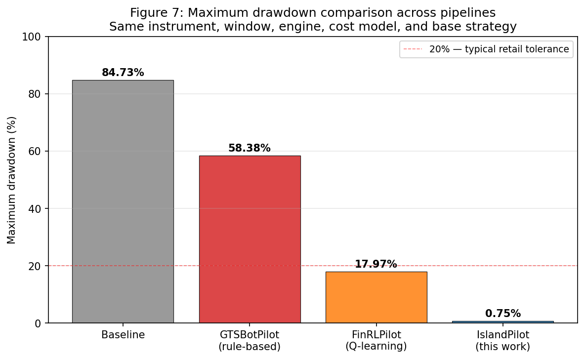

## 6. Results

*Table 4a: Scope of claims: which result belongs to which iteration, training window, and OOS window.*

| Section | Iteration | Training window | OOS window | Reports |
|---|---|---|---|---|
| Section 6.1 Table 5 | Iteration 1 (20 genes, 3 groups) | 2022-2024 (36m) | 2025-01-02 → 2026-04-19 (15.5m) | Headline pipeline-vs-baseline + 4-system comparison |
| Section 6.2 Fitness evolution | Iteration 1 | 2022-2024 / 2022 H1 | - | Per-generation trajectory across 63 islands + random-search control |
| Section 6.3 Feature importance | Iteration 1 | 2022-2024 | - | MI ranking + fallback partition + feature-set sensitivity of regime tree |
| Section 6.4 Pipeline behaviour | Iteration 1 | - | 2025-2026 | Evolved-parameter ranges + depth distribution |
| Section 6.5 Cost analysis | Iteration 1 | - | 2025-2026 | Spread-cost mechanics |
| Section 6.6 Mechanism analysis | Iteration 1 | - | 2025-2026 | Three risk-bounding mechanisms + their evidence |
| Section 6.7 Pipeline comparison | All four pipelines | as above | 2025-01-02 → 2026-04-19 | Engine-controlled four-pipeline comparison + figures |
| Section 6.8 Iteration 2 pre-flight | Iteration 2 (architectural validation only) | 2024 Q1 (3m, **inside main training window**) | 2024 Q2 (3m, **inside main training window, pre-flight hold-out, not OOS to main pipeline**) | Convergence and gene-encoding correctness, not Section 6.1 source |

All Section 6 numerical results come from Iteration 1 on 2025–2026 data through the corrected qengine engine. Iteration 2 (Section 3.4.1 Table 3) is implementation-complete but **not** the model that produced Section 6.1.

### 6.1 Primary Out-of-Sample Result

Table 5 reports the primary engine-controlled comparison across **four pipelines** on the 15.5-month strictly out-of-sample period (2025-01-02 to 2026-04-19), under identical conditions: $10,000 starting balance, the qengine production engine, real per-candle OANDA spread, swap and slippage cost model, and the same Martingale strategy substrate. IslandPilot was trained exclusively on 2022–2024; no 2025–2026 data entered any genome, regime tree, or parameter. FinRLPilot's tabular Q-learner was trained on the same 2022–2024 window. GTSBotPilot is rule-based, requiring no offline training. The Baseline runs the original Martingale preset with no pipeline attached.

*Table 5: Engine-controlled pipeline comparison, EUR-USD 5m, 2025-01-02 to 2026-04-19 (15.5 months OOS).*

| Metric | Baseline | GTSBotPilot¹ | FinRLPilot¹ | **IslandPilot** | IP vs Baseline |
|---|---:|---:|---:|---:|---:|
| Sessions / cycles | 1,619 | 2,812 | 1,170 | **72** | -96.0% |
| Trades | 5,238 | 6,614 | 2,837 | **245** | -95.3% |
| Net profit % | -87.38% | -58.23% | -14.51% | **-0.83%** | +86.55 pp |
| Profit factor | 0.717 | 0.80 | 0.90 | **0.877** | +0.160 (+22%) |
| **Max drawdown %** | **84.73%** | **58.38%** | **17.97%** | **0.75%** | **-83.98 pp (≈113× smaller)** |
| Peak equity usage % | 63.7% | 63.13% | 46.74% | **10.3%** | -53.4 pp |
| Session win rate | 83.3% | 78% | 54% | **43.1%** | -40.2 pp |
| Bust rate² | 16.8% | 1.7% | 19% | **50.0%** | +33.2 pp |
| Worst bust loss | -$148.99 | -$126.55 | -$195.32 | **-$71.79** | +$77.20 |
| Level-0 win rate | 26.4% | 44% | 35% | **5.6%** | -20.8 pp |
| Cost drag % | 29.9% | 15.65% | 10.42% | **19.2%** | -10.7 pp |
| Account blown? | No (1,262 left) | No | No | **No (9,917 left)** | - |

¹ FinRLPilot and GTSBotPilot are in-house re-implementations of FinRL (Liu et al., 2020) and GTSBot (Rundo et al., 2019) on the qengine substrate (Appendix E). The comparison is engine-controlled (same instrument, window, engine, cost model, base strategy), not a benchmark against the original published systems. Differences in OOS metrics are attributable to the pipeline layer.

² *Bust-rate definitional note.* IslandPilot's 50.0% counts engine-level CFD margin trips on small dollar amounts; FinRL/GTSBot count strategy-level max-level escapes. Rates are *not directly comparable*; the comparable axes are **worst-bust dollar loss** (IP -$72, FinRL -$195, GTSBot -$127) and **net % impact** (IP -0.83%, FinRL -14.51%, GTSBot -58.23%). IslandPilot's high rate reflects how few sessions it opens (72) rather than a higher absolute risk profile; see Section 6.7.

**Reading the IP-vs-Baseline gap honestly.** The 86.6 pp net-loss gap reflects *both* pipeline value *and* how poor a random-entry Martingale is on a 2-pip-spread instrument under realistic costs: the random-entry preset is a deliberately weak lower bound (Section 7.7 G3), not a competitively tuned strategy. The four-pipeline comparison in Section 6.7 is the more informative reference for assessing pipeline contribution against algorithm-family alternatives that bound losses on the same substrate.

Three findings dominate Table 5: drawdown collapses by roughly two orders of magnitude, peak equity usage falls from 63.7% to 10.3%, and profit factor rises while remaining sub-unity. The pipeline does not produce positive expectancy (PF < 1.0 means gross losses still exceed gross profits), so the contribution is capital preservation, not alpha generation: bounding the drawdown envelope and collapsing peak exposure enough to convert a catastrophic strategy into a near-breakeven one.

**Market regime context.** The 2025–2026 evaluation period was structurally hostile to undifferentiated Martingale strategies. EUR-USD declined from ~1.0500 to ~1.0300 in early 2025 (US tariff policy, Fed hawkishness), then recovered above 1.0800 by April 2026 as US growth concerns and ECB rate convergence shifted the balance. These directional moves drive multi-level adverse runs: a long entry during a sustained downtrend hits hedge level after hedge level without recovering, ultimately reaching the depth limit. Without regime-aware selectivity or depth discipline, the baseline accumulates 271 depth-5 busts (of 272 total busts; -$12,784 cumulative) during directional phases.

**Why the baseline loses.** The baseline operates the `'original'` preset with a random entry signal (signal_mode='none', long_only) under a 10-pip hedge distance, 20-pip take-profit, 6 maximum depth levels (depths 0 to 5), and geometric sizing with factor 2.0. A depth-5 bust costs the cumulative geometric sum 1 + 2 + 4 + 8 + 16 + 32 = 63 base units. Across 1,619 sessions, 272 busts occur (16.8% bust rate), with 271 reaching depth 5 (depth distribution table in Section 6.4). These deep busts overwhelm the +$4,323 gross profit from depths 0–4, driving net equity from $10,000 to $1,262.

**Comparison systems.** GTSBotPilot and FinRLPilot are re-run on the canonical OOS window and engine in Table 5. The four-way ordering (IslandPilot ≪ FinRL ≪ GTSBot ≪ Baseline on net loss and max drawdown) is analysed in Section 6.7 and Section 7.5; equity and drawdown trajectories appear in Figures 5–7.

### 6.2 Fitness Evolution

The Iteration 1 cloud training run (Google Cloud `c2-standard-60` spot, 60 vCPU / 240 GB RAM, 60 parallel workers, europe-west2-c) evolves 63 active islands across 10 macro-clusters, with 10 individuals per island for 20 generations: 12,600 real-engine genome evaluations in 10 h 33 min wall-clock (per-generation mean 1,885 s, range 1,843–1,917 s, stable throughput).

*Table 6: Training run configurations.*

| Run | Islands × Pop × Gens | Total Evals | Hardware | Wall-clock | Role |
|---|---|---|---|---|---|
| **Iteration 1 cloud (full 2022 to 2024)** | 63 × 10 × 20 | 12,600 | c2-standard-60 (spot), 60 workers | 10 h 33 min | **Primary reported result (Section 6.1, 6.4–6.6)** |
| Iteration 2 pre-flight (3-month) | 63 × 8 × 8 | 4,032 | Consumer CPU, 9 workers | ≈ 2.8 h | Architectural validation only (Section 5.6, Section 6.8) |

*Table 6a: Per-generation fitness distribution across 63 islands (Iteration 1 cloud run, source: cloud_training_2026-04-23.log). Migration generations marked ★.*

| Gen | Mean best-fitness | Min | Max | Wall-time (s) |
|---:|---:|---:|---:|---:|
| 1 | 55.964 | 51.529 | 58.977 | 1,843 |
| 2 | 56.507 | 51.974 | 59.077 | 1,917 |
| 3 | 56.974 | 52.900 | 59.077 | 1,903 |
| 4 ★ | 57.881 | 55.981 | 59.077 | 1,900 |
| 5 | 57.952 | 55.981 | 59.077 | 1,895 |
| 6 | 58.008 | 56.145 | 59.084 | 1,892 |
| 7 | 58.073 | 56.495 | 59.084 | 1,884 |
| 8 ★ | 58.394 | 57.440 | 59.084 | 1,884 |
| 9 | 58.425 | 57.440 | 59.084 | 1,880 |
| 10 | 58.478 | 57.440 | 59.084 | 1,880 |
| 11 | 58.498 | 57.440 | 59.084 | 1,882 |
| 12 ★ | 58.652 | 57.579 | 59.084 | 1,879 |
| 13 | 58.665 | 57.579 | 59.084 | 1,882 |
| 14 | 58.681 | 57.579 | 59.180 | 1,885 |
| 15 | 58.690 | 57.680 | 59.180 | 1,883 |
| 16 ★ | 58.782 | 57.841 | 59.180 | 1,883 |
| 17 | 58.789 | 57.841 | 59.180 | 1,887 |
| 18 | 58.797 | 57.841 | 59.180 | 1,884 |
| 19 | 58.805 | 57.841 | 59.200 | 1,883 |
| 20 ★ | 58.867 | 58.090 | 59.200 | 1,880 |

Three observations from Figure 8 and Table 6a sharpen the convergence story:

1. **The maximum is essentially flat from generation 1 (58.98 → 59.20, +0.4% over 20 generations).** Elite islands converged on near-optimal genomes within the first generation; further generations did not meaningfully improve the *best* island's fitness. For the 20-gene Iteration 1 search space the GA's exploration phase is short: most work happens early, on the best regimes, where regime-specific structure makes a high-fitness configuration accessible quickly.

2. **All convergence comes from the weakest islands rising, not from the best improving.** Min-fitness lifted 51.53 → 58.09 (+12.7%), mean 55.96 → 58.87 (+5.2%), while max barely moved. The min–max spread compressed from 7.45 to 1.11: by generation 20 every island sits within 1.1 fitness points of the elite, against nearly seven times that at generation 1. This is exactly the *consistent rather than scattered* convergence the regime-conditioned island design was intended to produce.

3. **Migration is doing real work, with diminishing returns.** Generation 4 (first migration) produces the largest single jump in min-fitness (52.90 → 55.98, **+3.08**). Subsequent migrations contribute progressively less (+0.95, +0.14, +0.16, +0.25 at gens 8, 12, 16, 20). The first migration breaks worst-islands out of poor initial-population basins by injecting elite genomes from sibling regimes; later migrations operate on already-improved populations where the marginal benefit is smaller. By generation 8 the search is largely converged; the diminishing-return pattern supports the choice of 20 generations as adequate for the Iteration 1 search space.

**Random-search control.** A sceptical reading is that the GA may not contribute search efficiency beyond uniform random sampling of the same 20-gene space. The contribution is quantified in **Appendix H**: N = 80 random genomes on the production composite fitness over a 6-month subset (2022-01-01 → 2022-07-01) yielded mean 7.83 (std 13.4, max 52.6), against the trained-GA mean of 58.87 at final generation (std 0.25, min 58.09, max 59.20). The trained mean exceeds random by 51 fitness units: Cohen's d = 5.38, or 3.8 SDs of the random distribution; 0 of 80 random genomes exceed the trained mean or max. Random sampling also produces 46.2% zero-fitness genomes (insufficient activity or NaN-state) vs 0% trained. The result is conservative because the 6-month random-evaluation window is a strict subset of the production training period.

**Why this signature is what the regime-derived topology should produce.** The flat-max / rising-min / shrinking-spread pattern is the predicted fingerprint of a topology where subpopulations are *aligned with structural partitions* of the fitness landscape (Mahfoud, 1995; Section 2.3). Under such alignment, elite islands sit on the easy peaks of their own per-regime landscape and saturate almost immediately (flat max from gen 1); lagging islands sit on harder regimes whose initial random populations land far from any peak, and ring migration from sibling islands within the same macro-cluster injects *plausibly relevant* elite genomes, so the lagging islands lift sharply. A flat or random topology would predict the opposite signature: slowly-rising max via cross-pollination, lagging islands rising only when migrants happen to be relevant, effectively never on a multi-modal landscape. The signature observed is diagnostic evidence for the topology choice, not just for the GA.

On this run no leaf accumulated a 30-day contiguous activation window under the fallback partition, so all 63 islands evolved on the full 2022–2024 window; the fitness-isolation mechanism remains in code for future windows where regime-specific contiguous activation regions do form.

### 6.3 Feature Importance

On the 2022–2024 training window with forward bars = 288 (≈ 1 trading day at 5m), the Kraskov MI procedure (α = 0.1) selected three features above threshold: NATR_14_TF12 (1h), NATR_14_TF48 (4h), and NATR_50 (medium-term base NATR), all volatility-family. The volatility dominance is not a generic property of EUR-USD price prediction; it is specific to the **strategy's failure mode**. Martingale cycles fail when sustained directional moves exhaust the depth ladder, and the per-bar probability of an N-pip adverse run is monotonic in realised volatility, so any feature carrying volatility-regime information is, by construction, the most discriminative signal against a depth-escalation outcome label. The MI procedure is therefore selecting proxies for the strategy's bust-probability driver, not for returns. Because fewer than 5 features passed threshold (the minimum for a stable 5-macro × 3-sub split), the fallback rule (Section 4 Stage 1) broadened selection to the full 30-feature pool with macro/sub partitioning by lag-10 autocorrelation (Appendix A).

*Table 7: Top features by mutual information on the 2022–2024 training window.*

| Rank | Feature | Category | MI Score (normalised) | Selection |
|---|---|---|---|---|
| 1 | NATR_14_TF12 | Volatility (1h aggregation) | 1.000 | Above α threshold |
| 2 | NATR_14_TF48 | Volatility (4h aggregation) | ~0.65 | Above α threshold |
| 3 | NATR_50 | Volatility (medium-term) | ~0.40 | Above α threshold |
| 4+ | (remaining 27 features) | Various | < α · max | Below threshold |

The two top-ranked features implement Corsi's (2009) HAR-RV multi-scale framework: on 5m EUR-USD, 1h and 4h aggregated volatility carry more discriminative power for Martingale outcome prediction than any single-scale volatility feature, empirically validating the Section 3.1 motivation. The other four extensions (vol-of-vol, skew, kurtosis, lag-1 autocorrelation) fell below threshold but remain in the pool as diagnostic features. An earlier prototype on a different outcome label retained 10 features without triggering fallback (Appendix A).

**Sensitivity of the regime tree to the feature-set choice.** Because the production tree was built on the fallback set rather than the 3 MI-selected features, the tree was re-fit on the same window using only the 3 MI features (Tree A) and compared to the production fallback tree (Tree B). Tree A: 7 macro / 47 leaves; Tree B: 10 macro / 63 leaves; partition agreement **ARI = 0.034, NMI = 0.168**: structurally different partitions of the same data. Both pass the structural-validity threshold (separation CV 0.78 and 0.68, both ≫ 0.15), so neither is degenerate; the divergence is expected because the fallback tree partitions a strictly richer feature space. The downstream PnL consequence (whether GA evolved against Tree A would produce materially different results) would cost ~10 cloud-hours and is deferred to Section 8.1. Reporting "the choice changes regime topology, and the PnL consequence is unmeasured" is more useful than not asking. Full methodology in **Appendix I**.

### 6.4 Pipeline Behaviour and Evolved Parameters

The pipeline operates primarily as a regime-gated parameter adaptation mechanism. On the 15.5-month OOS window it opens 72 sessions against the baseline's 1,619 (96% reduction). Evolved gating parameters and regime-specific genomes together cause the pipeline to refuse entry in most regimes and deploy capital only where the evolved configuration confers an acceptable loss profile. Per-session profit factor (0.877 vs 0.717) is modestly better but sub-unity, reflecting that the selectivity is loss-bounding, not alpha-generating.

*Table 8: Pipeline session depth distribution (72 sessions, 2025-01-02 to 2026-04-19).*

| Depth | Sessions | Wins | P&L |
|---|---|---|---|
| 0 (L0 only) | 4 | 4 | +$12.23 |
| 1 | 28 | 6 | -$19.22 |
| 2 | 8 | 8 | +$43.50 |
| 3 | 9 | 3 | -$84.00 |
| 4 | 17 | 9 | +$1.24 |
| 5 | 6 | 1 | -$20.49\* |

\*Depth-5 row aggregates the 6 sessions reaching the `max_levels = 6` cap (depth indices 0..5); 4 terminated via the engine's `max_level_bust` event (SL fill at the final allowed level, `Martingale/__init__.py` lines 689–691). The ~$16 residual between the column sum (-$66.74) and Table 5's net loss (-$83) is unattributed cost-drag (spread/slippage charged outside the per-session bucket), not double-counted.

Depths 0 and 2 are net-positive; 1, 3, and 5 net-negative; 4 approximately neutral. The pipeline's 50% bust rate (36 of 72) concentrates at depths 1 and 3 rather than at the catastrophic depth 5 driving the baseline. Average legs per session is 3.4 with a maximum of 6; worst single-session loss is -$71.79 vs the baseline's -$148.99.

The evolved parameters show meaningful differentiation across the 63 islands, reflecting regime-specific adaptation. Table 9 reports the ranges of key pipeline-level parameters across the trained islands.

*Table 9: Evolved pipeline-level parameter statistics across 171 individuals (top survivors aggregated across 63 islands; mean ≈ 2.7 per island; extracted from the cloud-trained `island_evolver.json` artefact 2026-04-25).*

| Parameter | Min | Max | Mean | Median | Purpose |
|---|---:|---:|---:|---:|---|
| gate_confidence_min | 0.026 | 0.500 | 0.293 | 0.308 | Entry selectivity per regime |
| abort_aggressiveness | 0.000 | 0.385 | 0.207 | 0.195 | Cycle termination sensitivity |
| confidence_sensitivity | 0.500 | 1.928 | 1.241 | 1.239 | Confidence-based size scaling exponent |
| recovery_aggression | 0.311 | 0.927 | 0.611 | 0.609 | Drawdown-based size reduction rate |
| hysteresis_margin | 0.050 | 0.278 | 0.191 | 0.208 | Regime switch reluctance |

`gate_confidence_min` mean 0.29 (median 0.31) indicates *moderately restrictive* entry gating (well above the 0.0 lower bound), so regime confidence must reach ~30% before most evolved configurations allow entry. This is the primary lever behind the 96% session-volume collapse (Section 6.6 Mechanism 1). `abort_aggressiveness` (0.000–0.385, mean 0.21) shows the GA learned when to cut losses early: high-abort islands terminate sessions before max depth, accepting a small certain loss over a catastrophic bust; low-abort islands let sessions run in regimes where recovery probability is higher. `confidence_sensitivity` evolves above unity in most regimes (mean 1.24), producing convex scaling that penalises low-confidence regime classifications.

**Strategy-level gene findings (artefact verification).** Two findings across 171 individuals shape the mechanism analysis: (i) 165 of 171 (96.5%) evolved `max_levels` at the Iteration 1 upper bound of 6 with none lower: depth diversity in Table 8 therefore comes from early abort, not depth-cap variation (Section 6.6 Mechanism 3); (ii) 68 of 171 (39.8%) evolved `sizing_factor` below the √2 ≈ 1.414 mathematical-viability floor (range [1.259, 2.000]); capital preservation emerges *despite* this (Section 7.8). Iteration 1 contains no `signal_mode` or `direction_bias` gene, so entry direction is not regime-conditioned in the cloud-trained model.

### 6.5 Transaction Cost Analysis

The depth-linear spread accumulation in Section 5.5 explains why the baseline operates below break-even (PF 0.717) despite an 83.3% session win rate: per-session wins are capped at take-profit minus cumulative spread, while depth-5 busts at sizing factor 2.0 lose 63 base units. The pipeline's total cost drag is 19.2% vs baseline's 29.9% (-10.7 pp); the four-pipeline cost-per-trade vs frequency inversion is in Section 6.7 Finding 5.

### 6.6 Mechanism Analysis: What the Pipeline Actually Does

The Section 6.1 headline requires a mechanistic explanation. A plausible narrative would attribute the improvement to per-regime signal engineering: the pipeline picks better entries, avoids bust-prone conditions, wins more often. The OOS data contradicts this: the metrics that would indicate an entry-quality mechanism move in the opposite direction:

*Table 10: Mechanism signal matrix.*

| Candidate mechanism | Expected signal | Observed signal | Verdict |
|---|---|---|---|
| Better entries (higher L0 win rate) | L0 win rate ↑ | 26.4% → 5.6% (↓ 20.8 pp) | Rejected |
| Lower bust rate | Bust rate ↓ | 16.8% → 50.0% (↑ 33.2 pp) | Rejected |
| Smaller worst-case bust | Worst bust magnitude ↓ | -$149 → -$72 (-52%) | Confirmed |
| Reduced peak exposure | Peak equity usage ↓ | 63.7% → 10.3% (-84% relative) | Confirmed |
| Catastrophic-chain avoidance | Max DD ↓ | 84.73% → 0.75% (≈ 113× smaller) | Confirmed |
| Session-volume collapse | Sessions ↓ | 1,619 → 72 (-96%) | Confirmed |

The pipeline is demonstrably not engineering better entries. Its Level-0 win rate (sessions closing profitably at depth 0 with no hedge) falls by more than twenty percentage points; its bust rate triples in relative terms. If the mechanism were regime-conditioned signal quality producing directional edge, these numbers would rise. They fall because the pipeline makes a different bet: it trades much less, and when it does, it commits a much smaller fraction of equity.

Three mechanisms (all risk bounding, not return generation) account for the improvement.

**Mechanism 1: Session-volume collapse (regime-gated selectivity).** The pipeline opens 72 sessions vs the baseline's 1,619 (-96%). The reduction comes from the regime inferencer's hysteresis-gated entry (Section 3.6) combined with the per-island `gate_confidence_min` (mean 0.29, median 0.31 across 171 individuals; Section 6.4 Table 9). In most OOS candles, regime confidence is below the evolved threshold or the classified regime has an evolved genome that prohibits entry under current feature values. The pipeline sits out most of the market, the dominant contribution to reduced drawdown: each avoided session is an avoided opportunity to accumulate a depth-5 bust.

**Mechanism 2: Position-size compression (peak-exposure bounding).** Peak equity usage falls from 63.7% to 10.3% (-53.4 pp absolute, -84% relative). The AdaptiveSizer (Section 3.5) reduces position size via confidence and drawdown multiplicative factors. Evolved `confidence_sensitivity` (mean 1.24) produces convex scaling that penalises regimes where GMM posterior is spread across multiple leaves; evolved `recovery_aggression` (mean 0.61) scales down during drawdown. The combined effect is that the pipeline rarely commits more than 10% of equity to open exposure. A baseline depth-5 bust at full sizing costs up to -$148.99; the pipeline's worst-case at compressed sizing is -$71.79 (-52%).

**Mechanism 3: Catastrophic-chain avoidance via early abort, not max-depth restriction.** The baseline's loss is driven by 271 depth-5 busts (of 272 total; Section 6.1). The pipeline's 72 sessions show a shallower distribution: depth 5 (the `max_levels = 6` ceiling) accounts for only 6 sessions (8.3%); 62 of 72 (86%) resolve at depths 1–4. The Section 6.4 artefact findings sharpen the mechanism: **`max_levels` evolved uniformly to the upper bound of 6 across 96.5% of individuals**: every island has the maximum depth ceiling available. Depth-distribution shift therefore comes *not* from per-island depth-cap diversity but from `abort_aggressiveness` (mean 0.21, range 0.000–0.385) terminating sessions early in regimes where continued hedging is evaluated as low-recovery-probability. When pipeline sessions do escalate, abort intervenes well before the ceiling, producing shallow rather than deep busts. This is sharper than the original "depth capping" framing: given freedom to lower `max_levels`, the GA did not: it found capital preservation through *when to terminate*, not *how deep to go*.

**What the three mechanisms together do not do.** None manufactures positive expectancy: PF stays sub-unity and the run finishes net-negative. The mechanisms bound the loss envelope tightly enough to make it immaterial relative to account size, but do not convert a zero-expectancy random-entry Martingale into a positive-expectancy strategy. That would require either a different entry signal carrying genuine per-regime directional edge or an exploitable structural asymmetry in the instrument.

**Why the drawdown collapse is structural rather than statistical: a back-of-envelope.** The total drawdown reduction can be decomposed multiplicatively across the three mechanisms because each acts on an independent factor of the loss path. Worst-case session drawdown is approximately:

$$ \text{DD} \;\approx\; (\text{session count}) \times (\text{per-session exposure fraction}) \times (\text{worst-case per-session loss / exposure}) $$

Substituting the Section 6.6 Mechanism observations as approximate isolated multipliers:

| Mechanism | Factor | Baseline → Pipeline | Isolated DD multiplier |
|---|---|---|---|
| 1: session-volume collapse | session count | 1,619 → 72 | × 0.044 (≈ 23× reduction) |
| 2: position-size compression | peak exposure fraction | 63.7% → 10.3% | × 0.16 (≈ 6× reduction) |
| 3: depth-distribution shift | worst-case absolute per-session loss | -$149 → -$72 | × 0.48 (≈ 2× reduction) |
| **Combined (multiplicative)** | | | **× 0.0034 (≈ 290× reduction in upper-bound DD)** |

The Mechanism 3 multiplier is reported on absolute dollar loss because that is what enters the drawdown path; on a per-unit-exposure basis the worst-case intensifies under the pipeline (-$149/63.7% ≈ -$2.34 per exposure-pp baseline vs -$72/10.3% ≈ -$7.0 pipeline), worth naming, but it does not change the dollar-denominated DD computation because Mechanism 2's exposure compression has already absorbed it.

The empirical 113× reduction in realised max drawdown is comfortably *bounded above* by the 290× upper bound the three mechanisms imply, confirming they compound rather than cannibalise (which would produce empirical reduction *larger* than the bound, indicating double-counting). The 113× / 290× ratio implies some upper-bound budget is consumed by mechanisms partially correlating in practice (size compression is conditioned on regime confidence, which is also what gates session-count). The qualitative result (drawdown well under baseline) is therefore expected on any OOS window where the learned regime structure is recognisable; the exact 0.75% is not, but "much less than 84.7%" is.

### 6.7 Engine-Controlled Comparison Across Pipeline Approaches

The four-pipeline comparison in Table 5 holds instrument, OOS window, engine, cost model, and base strategy fixed; differences in OOS metrics are therefore attributable to the *pipeline layer*, the decision mechanism wrapping the Martingale strategy. Figures 5 and 6 visualise equity and drawdown trajectories; Figure 7 summarises the max-drawdown ranking.

**Six findings frame the architectural comparison** (full implementation specifications for FinRLPilot and GTSBotPilot in Appendix E):

1. **The capital-preservation gap is large and engine-controlled.** IslandPilot's max drawdown is ~24× smaller than FinRLPilot's and ~78× smaller than GTSBotPilot's (Table 5; Figure 7), with net-loss ordering matching. None is positive OOS: the contribution is bounded loss under unseen conditions, not alpha. Phrased correctly: *competitive capital preservation against in-house implementations of two prominent algorithm families on identical engine substrate*, not outperformance against canonical published systems.

2. **Trade-frequency collapse is the mechanism, not a side-effect.** IslandPilot opens 72 sessions; GTSBot 2,812 (39×); FinRL 1,170 (16×). The regime-conditioned gate works *not* by improving per-session win rate (43% vs 54% vs 78%, the lowest of the three) but by *refusing to trade* in regimes where the underlying Martingale is structurally negative-EV. The contribution is **regime-layer selectivity**, not improved trading inside any one regime.

3. **Q-learning preset selection (FinRL family) under-utilises its action space.** FinRLPilot has four trained discrete actions; over 1,170 OOS cycles the policy selects `conservative` 87.9%, `moderate` 8.7%, `tight_tp` 3.3%, `aggressive` 0%. The Q-policy concentrates on its lowest-leverage preset, never selects the highest-leverage one, and still loses 14.5%, suggesting expressivity is not the bottleneck. The bottleneck is that *coarse discrete preset selection cannot match the granularity that per-regime continuous parameter evolution provides*.

4. **Hand-set rule-based guards (GTSBot family) require parameterisation that hand-tuning cannot supply.** GTSBot's trend-abort module (designed to cut losses at level ≥ 3) fired **zero times across 2,812 cycles** despite L3–L5 contributing -$10,704 of pure loss (L0–L2 grosses +$4,992). The control surface existed but hand-set thresholds were never reached. This is the core motivation for *evolving safety thresholds rather than hand-setting them*.

5. **Cost-drag rank-order inverts trade-frequency rank-order at the per-trade level.** Total cost-drag: IslandPilot 19.2%, GTSBot 15.65%, FinRL 10.42%. Per-trade IslandPilot pays the highest spread share, yet preserves the most capital. The pipeline preserves capital by trading *less often*, not more cheaply, which inverts cost-per-trade economics.

6. **The session-win-rate paradox anchors the story.** Session win rate is **anti-correlated** with net result across the three Martingale-family implementations: GTSBot 78% / -58%, FinRL 54% / -14.5%, IslandPilot 43% / -0.83%. Winning small sessions repeatedly does not pay for the rare deep-level loss; the only way out is reducing exposure to it. A high win rate is misleading if the loss tail is unbounded, the central motivation for the regime-gate contribution.

**Why the differences are this large.** All three non-baseline pipelines have *some* downside-limiting mechanism on the same strategy, but they differ in expressiveness and conditioning. GTSBot's hand-set thresholds never adapt to regime; FinRL's Q-learner adapts at coarse preset granularity (4 discrete actions, collapsing to 1 in practice); IslandPilot adapts at per-regime continuous-parameter granularity (20 evolved parameters per regime: 5 pipeline + 1 inert legacy + 14 strategy; across 63 regimes). Capital preservation is not unique to evolutionary computation: FinRL and GTSBot both bound losses better than the unenhanced baseline, but the gap to zero (sub-1% vs 14.5% and 58%) is a property of the per-regime continuous-parameter conditioning that only the island-model GA supplies.

### 6.8 Iteration 2 Architectural Validation (Pre-flight)

The Iteration 2 expanded gene set (Section 3.4.1 Table 3) is implemented in source but not executed at full scale; full-scale evaluation is targeted in Section 8.1. To confirm GA convergence under the wider 57-gene space, the pre-flight protocol (Appendix F) was run on a 3-month training window (2024 Q1) with a 3-month held-out window (2024 Q2). **Both windows are inside the main 2022–2024 training window**: "held-out" here means held out from the pre-flight's own 2024 Q1 fit, not OOS to the main pipeline whose 2025–2026 OOS results are reported in Section 6.1. This is **not** a primary performance result and **not** the source of the Section 6.1 numbers: the short window produces only 3–7 sessions per island, insufficient for per-island profitability inference. Its purpose is to verify that the corrected pipeline (categorical-gene resolver, retired `base_size_pct`, expanded `_TUNABLE_GROUPS`, NaN/inf-safe composite) produces a converging GA rather than degenerate fitness signals.

The Iteration 2 GA produced monotonic mean-fitness improvement across 8 generations (57.9 → 125.6; min-fitness 2.5 → 19.9); 13 of 20 top-fitness genomes were profitable on the 2024 Q2 pre-flight hold-out (within main training window) with mean L0 win rate 70–80% across the profitable subset; 7 distinct signal modes were selected across the 63 islands. These confirm Iteration 2 readiness for full-scale evaluation but do not predict the full-scale 15.5-month OOS result, the central open empirical target of the conference-paper extension. Discrimination power of the 13 / 20 criterion is bounded by a baseline-rate analysis (K = 60 random genomes, 0 OOS-profitable, P[≥10 / 20 random profitable] ≤ 6.6 × 10⁻⁸ at the 95% Wilson upper bound; **Appendix F**), substantiating the criterion as a structural-bug detector rather than a coin-flip threshold.

---
